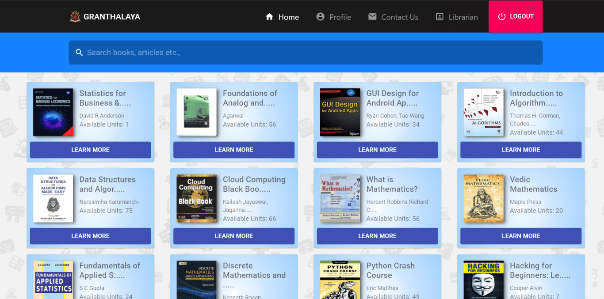
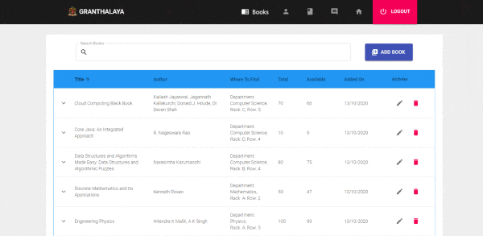
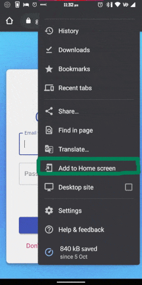

<h1 align="center">  GRANTHALAYA</h1>

An Online Library Management System. Built with React and Firebase

---

## Introduction

_\*\*built and submitted as a college project_  
A web app built using React and firebase to simplify the process of searching, borrowing, and returning the books at a library. Every user has a personalized profile where they could check their borrowed books and
even perform different actions.
 
 

---

## Key Features

A few things any user can do:

- Login/Signup
- Easy to use search
- Borrow, Reserve, Return books
- Where to find books within library
- Update profile details / profile picture
- Message admin through contact-us form
- Mobile support

Admin specific features:

- Add, Edit or Delete books
- Edit user details
- Assign books to users
- Check user reservations
- Reply to user messages

---

## Demo

For demo, Use below details and login to [Granathalaya Web App](https://granthalay.web.app)

    username: user@granthalaya.com
    password: demoUser@2020

---

## Built using

The web app is built using react and firebase.

Frontend tech:

- React V16.13.1
- Material UI V4.11.0
- Redux V4.0.5

Firebase services utilized: V7.22.1

- Firebase Authentication
- Cloud Firestore
- Cloud Storage

---

## Previews

### Web

### Admin Panel

### Mobile

The web app can be install as a stand-alone application by pressing the 3 dot-menu with in any browser and choosing "Add to Home" option.
 
 

---

## Development Progress

User Panel:

- [:heavy_check_mark:] Login/ Signup page

  - [:heavy_check_mark:] login
  - [:heavy_check_mark:] signup
  - [:heavy_check_mark:] forgot password

- [:heavy_check_mark:] Home page

  - [:heavy_check_mark:] search panel
  - [:heavy_check_mark:] books panel
  - [:heavy_check_mark:] book details panel

- [:heavy_exclamation_mark:] Profile page

  - [:heavy_check_mark:] User details, edit details, change password
  - [:heavy_check_mark:] books reserved
  - [:heavy_check_mark:] book borrowed
  - [:bangbang:] deal 0 days left, 0 hrs left, reserved books: Removing books from user profile and updating users, borrowed books: Update user

- [:heavy_check_mark:]Contact-us page
  - [:heavy_check_mark:] send message

Librarian Panel:

- [:heavy_check_mark:] Common to all tables

  - [:heavy_check_mark:] search
  - [:heavy_check_mark:] pagination
  - [:heavy_check_mark:] sorting

- [:heavy_check_mark:] Books Panel

  - [:heavy_check_mark:] add books
  - [:heavy_check_mark:] edit books
  - [:heavy_check_mark:] delete books
  - [:heavy_check_mark:] drop down

- [:heavy_exclamation_mark:] Users Panel

  - [:x:] add user
  - [:x:] edit user
  - [:x:] delete user
  - [:bangbang:] assign books to user: backend impl remains
  - [:bangbang:] drop down: frontend impl remains

- [:heavy_exclamation_mark:] Reservations Panel

  - [:heavy_check_mark:] updates regarding every user reservations
  - [:bangbang:] user borrowed: backend impl remains
  - [:bangbang:] reject: backend impl remains
  - [:bangbang:] order by recent

- [:heavy_exclamation_mark:] Messages Panel
  - [:bangbang:] reply: backend impl remains
  - [:heavy_check_mark:] drop down

---

## Future Development

- The app could be further improved by implementing a few additional concepts. These
  are primarily physical entities that could further improve the application.
- In the current state, the application is dependent on the user’s input for borrowing
  or reserving a book that could be misused. That is, the user could unknowingly
  press borrow even if he/she is away from the library. This adds additional
  responsibilities to the librarian making it necessary for further audit.
- To Resolve this, a Barcode/ QR-code dependant system could be implemented
  which works in the following way:
  - When the user is away from the library, he would only be able to reserve books.
  - At the entrance of the library, a Barcode/Qr-code would be set up. This could be updated daily to reduce the opportunity to misuse it.
  - The user would scan the barcode while entering the library using our mobile application.
  - Once the barcode is scanned, the user would be given the option to borrow books.
  - To borrow a particular book, the user would need to scan the custom barcode printed on the first page, once the barcode is scanned, the borrow button would be displayed. On clicking it, the book will be added to the user’s borrowed list.
  - While returning the book, The rack in which the returned books should be placed, will contain a bar-code. Once, the user presses return he should be asked to scan the code only then return would be accepted.
- To make this system further secure, the application should automatically ask for
  rescanning of the barcode every hour or so.

---

## Short-comings

- Currently user borrow, reserve, and return history isn
  't being stored
- Time isn't updated real-time, updated only when page is reloaded.
- Need to rethink reservations tab, admin end.

---

## Contribute

To contribute:

- Fork the repository
- Clone or Download it
- If necessary, create a new branch (`git checkout -b feature/feature-name`)
- `npm install` to install dependencies
- `npm start` to start localhost at port:3000
- make changes and add them to git.
- commit the changes (`git commit -m "commit-message"`)
- push them to github (`git push origin feature/feature-name`)
- Create a Pull Request

Found bugs?/Improvements: 

You can report them over [here](https://github.com/Mr-PY/Granthalaya/issues) by opening an issue or you could even message them over in the app through contact-us form.

## License

This project is licensed under the terms of the [MIT](LICENSE) license.

> GitHub [@Mr-PY](https://github.com/Mr-PY) &nbsp;&middot;&nbsp;
> Instagram [@mr.\_py](https://www.instagram.com/mr._py/)
